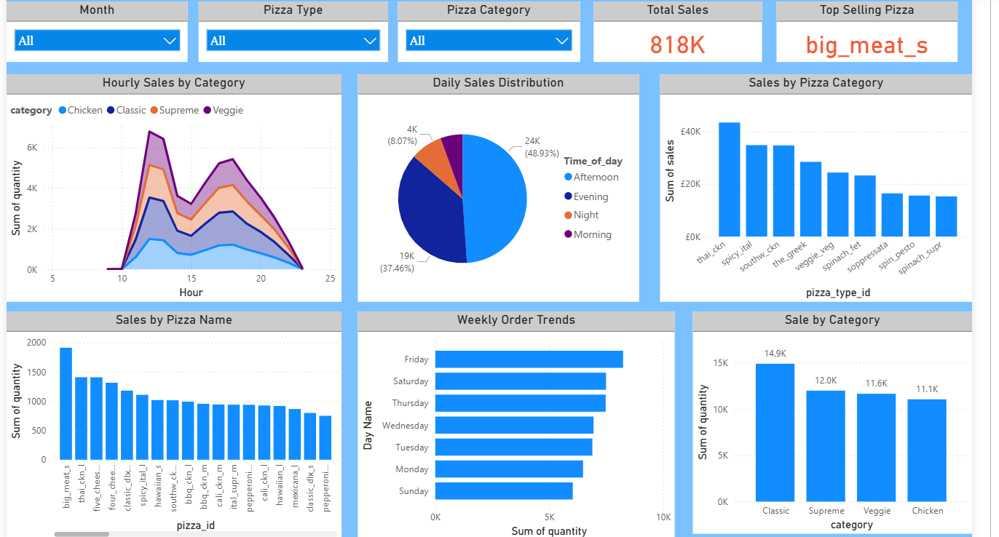
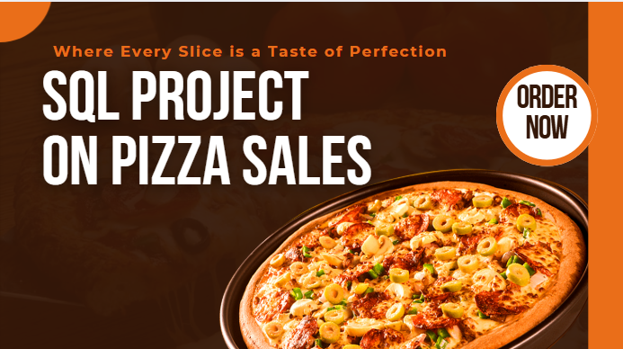

# 🍕 Pizza Sales Power BI Dashboard & SQL Analysis

## 📊 Project Overview
This repository contains:
- A **Power BI dashboard** for analyzing pizza sales performance  
- **SQL scripts** used to extract, transform, and analyze data  
- A **presentation** summarizing project insights, SQL results, and key findings  

Together, these files give a full end-to-end look at the Pizza Sales data — from raw data to insights.

---

## 📂 Files in This Repository
- **proj1 pizza.pbix** → Main Power BI file  
- **pizza_sales/** → Folder containing raw CSV datasets  
  - `orders.csv` → Customer order details  
  - `order_details.csv` → Pizza-wise order breakdown  
  - `pizzas.csv` → Pizza information  
  - `pizza_types.csv` → Pizza category and ingredients  
- **SQL/** → Folder containing SQL scripts  
  - `pizza_sales_insights_level1.sql` → Basic analysis (total orders, revenue, highest-priced pizza)  
  - `pizza_sales_insights_level2.sql` → Advanced metrics (hourly distribution, categories, average pizzas per day)  
  - `pizza_sales_insights_level3.sql` → Top pizza types by revenue, percentage contributions, cumulative analysis  
- **Pizza Sales Presentation.pdf** → Final project presentation slides, summarizing SQL queries, outputs, and insights  
- **pizza_proj_snapX.png** → Dashboard preview screenshots  

---

## 🔑 Key Insights
- 📅 **Monthly & Hourly Sales Trends:** Identifies peak months and hours  
- 🍕 **Top-Selling Pizza Categories:** Highlights most popular pizzas  
- 💰 **Revenue Contribution:** Shows which pizzas generate maximum revenue  
- 🛒 **Order Size & Customer Preferences:** Provides insights into ordering behavior  
- 🧠 **SQL Analysis:** Covers total orders, average pizzas per day, top 3 pizzas by revenue, and more  
- 🎤 **SQL Presentation:** Visually presents the SQL project, including key questions, queries, and conclusions  

---

## 🖼️ Dashboard & Presentation Preview
- 🔗 [Click here to view dashboard](https://1drv.ms/u/c/db5906d2e329e778/EefvOfDpxL1LilRlnMI5dHMBhFEfAIZ43fGxmnWmavC6FQ?e=rPllLJ)
- 🖥️ Download **Pizza Sales Presentation.pdf** from this repo to view all SQL queries, visualizations, and final results.
  
### 📷 Dashboard Preview

More snapshots are available in the repository for detailed view.

### 📷 SQL Presentation Preview

---

## 📥 How to Open
1. Download the `.pbix` file from this repository  
2. Open it in **Power BI Desktop** to explore interactive dashboards  
3. Open the `.sql` files in any SQL editor (MySQL, PostgreSQL, etc.) to see queries  
4. Review the **presentation PDF** for a complete summary of insights and visuals  

---

## ✍️ Author
**Sehr Qureshi**  
📧 Data Analyst | Power BI & SQL Enthusiast

---

⭐ **If you found this project helpful, consider giving it a star!**
